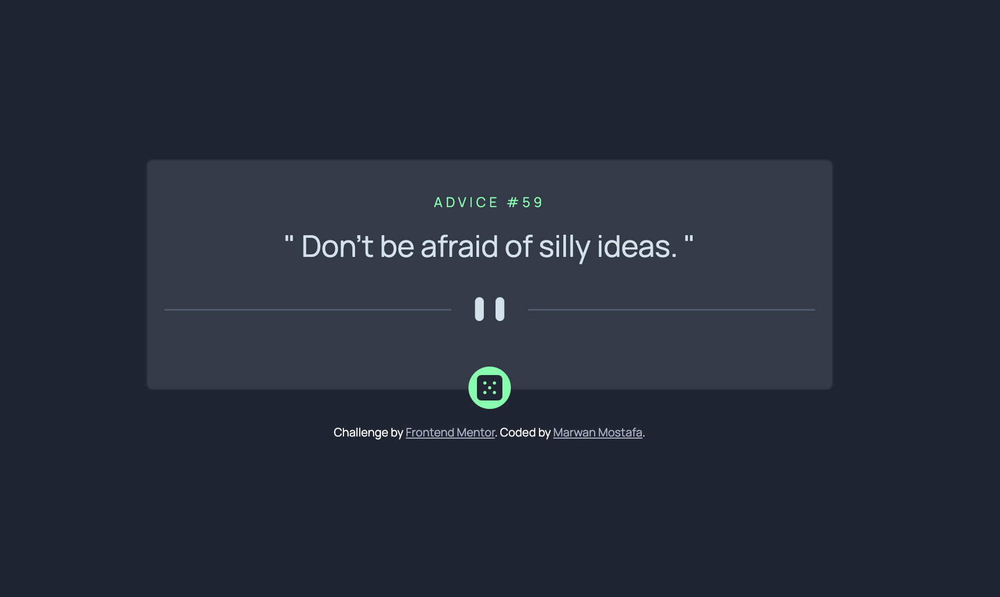
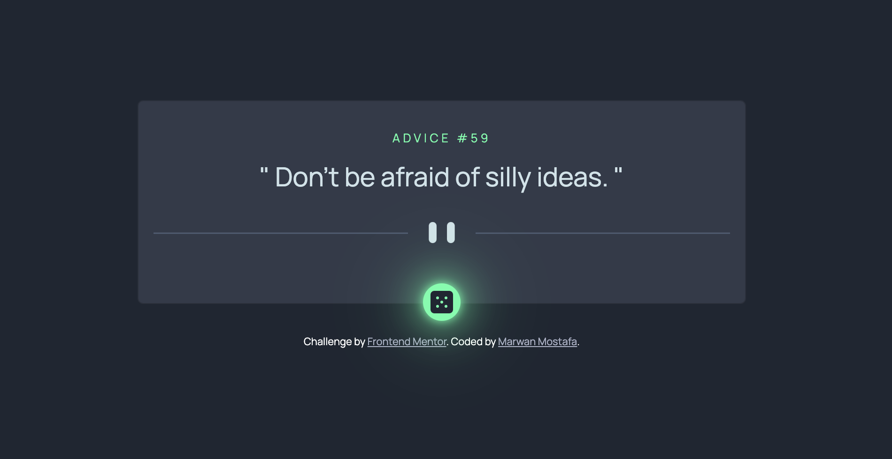
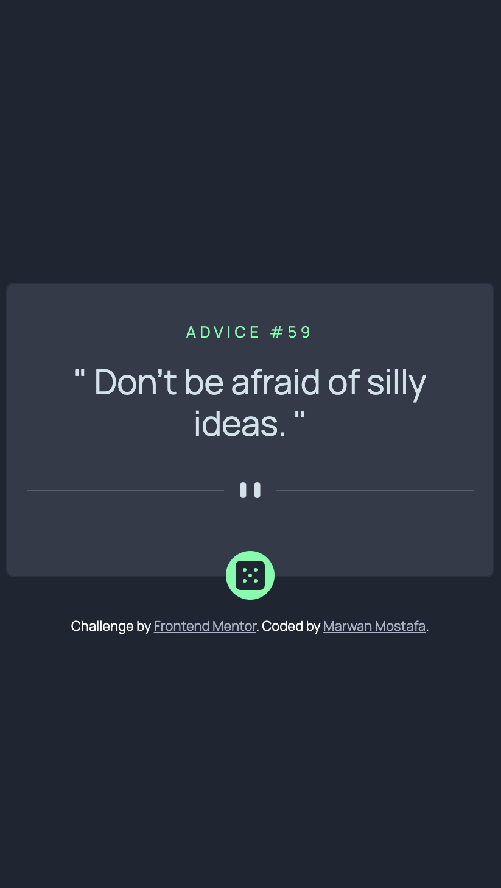

# Frontend Mentor - Advice generator app solution

This is a solution to the [Advice generator app challenge on Frontend Mentor](https://www.frontendmentor.io/challenges/advice-generator-app-QdUG-13db). Frontend Mentor challenges help you improve your coding skills by building realistic projects.

## Table of contents

- [Overview](#overview)
  - [The challenge](#the-challenge)
  - [Screenshot](#screenshot)
  - [Links](#links)
- [My process](#my-process)
  - [Built with](#built-with)
  - [What I learned](#what-i-learned)
  - [Continued development](#continued-development)
  - [Useful resources](#useful-resources)
- [Author](#author)

## Overview

### The challenge

Users should be able to:

- View the optimal layout for the app depending on their device's screen size
- See hover states for all interactive elements on the page
- Generate a new piece of advice by clicking the dice icon

### Screenshot

### Links

- Solution URL: [GitHub](https://github.com/MarwanMDev/advice-generator-app)
- Live Site URL: [Add live site URL here](https://your-live-site-url.com)

## My process

### Built with

- Semantic HTML5 markup
- CSS custom properties
- Bootstrap
- Advice Slip JSON API

### What I learned

Fetching date from the API and update UI.

### Continued development

Front End Development.

### Useful resources

- [Bootstrap 5](https://getbootstrap.com/docs/5.2/getting-started/introduction/) - This helped me to build and style components, I really liked this pattern and will use it going forward.

## Author

- Website - [Marwan Mostafa](https://github.com/MarwanMDev)
- Frontend Mentor - [@MarwanMDev](https://www.frontendmentor.io/profile/MarwanMDev)
